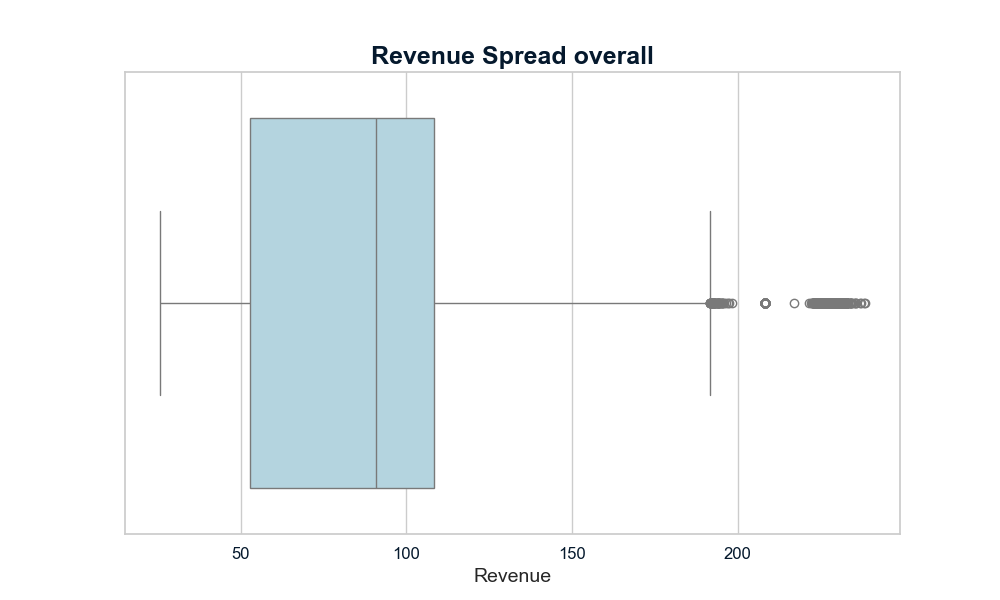
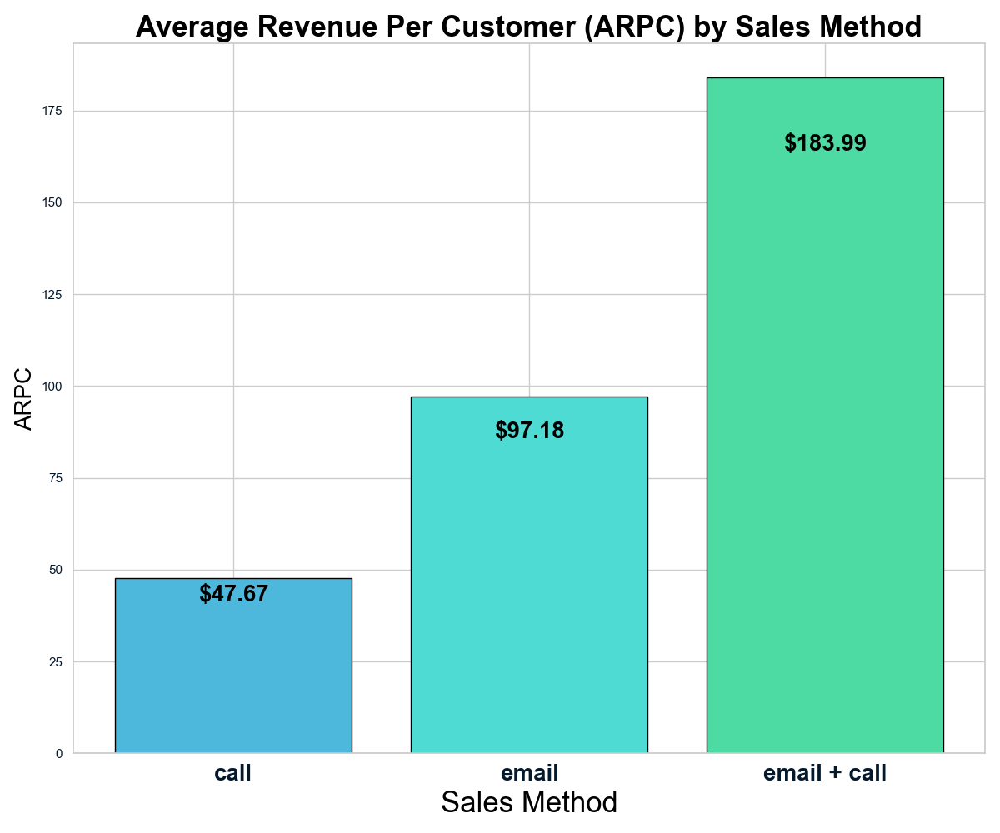

# Predicting Optimal Sales Method for Revenue Maximization

📌 **Disclaimer:**  
This project was completed as part of a DataCamp certification.  
The dataset and problem statement are inspired by the certification task,  
but all code, analysis, and insights presented here are my own.  

## 📌 Project Overview
This project is part of the **Data Analyst Professional Practical Exam Submission**, where the goal is to **identify the best-performing sales method that maximizes revenue while optimizing resource allocation**.

To achieve this, I conducted an in-depth analysis of customer data, revenue distribution, and sales methods to derive actionable business insights.

The final recommendations will help **the client’s sales team** enhance their strategy by balancing effort and revenue generation.

---

## 📊 Dataset Overview
The dataset consists of **14,998 transactions** after cleaning, with the following features:

| Column Name          | Type        | Description |
|---------------------|------------|-------------|
| `week`             | Numeric    | Week of the transaction |
| `sales_method`     | Categorical | Sales approach used (`Email`, `Call`, `Email + Call`) |
| `customer_id`      | Categorical | Unique identifier for each customer |
| `nb_sold`         | Numeric    | Number of units sold |
| `revenue`         | Numeric    | Revenue generated per transaction |
| `years_as_customer` | Numeric    | Customer’s tenure with the company |
| `nb_site_visits`   | Numeric    | Number of times the customer visited the website |
| `state`            | Categorical | Customer’s location |

---

## 🔍 Data Cleaning & Validation
- **Handled missing values**:
  - `revenue` had **7.16% missing values**, which were imputed using **regression-based imputation** based on `nb_sold` and `sales_method`.
- **Categorical Standardization**:
  - `sales_method` contained duplicate/misspelled values (`em + call`, `email`). Standardized values: `email`, `call`, `email + call`.
  - `state` values were reviewed and found to be consistent.
- **Outlier Removal**:
  - Customers with **40+ years of tenure** were treated as outliers (only 2 cases) and removed.
  - Verified revenue distribution across states, finding no significant impact.
- **Duplicate Check**: No duplicate records were found.

---

## 📈 Exploratory Data Analysis (EDA)
### Single Variable Analysis:
- **Revenue Distribution**:
  - Median revenue: **$90.70**
  - Revenue is right-skewed, with outliers in higher values.
  - Revenue distribution per sales method shows distinct patterns.

- **Customer Tenure vs. Revenue**:
  - Customers with **30+ years** generate lower median revenue than newer customers.
  - High churn rate after **1 year** but revenue remains steady.

### Multi-Variable Insights:
- **Revenue per Sales Method:**
  - `Email + Call` has the highest **average revenue per customer (ARPC) at $183.99**.
  - `Call` is the least efficient, generating the lowest revenue per customer.
  
- **Effect of Website Visits on Revenue:**
  - Strong correlation (**Spearman: 0.909, p-value < 0.001**) between number of visits and revenue.
  - Revenue is highest among customers with **21-31 visits**.

- **Time-Series Analysis:**
  - Revenue trends significantly differ across sales methods.
  - Kruskal-Wallis test confirms a **statistically significant** difference between all three methods.



---

## 🏆 Defining Key Business Metrics
### **Chosen Metric: Average Revenue Per Customer (ARPC)**
- **Why?**
  - Allows comparison across sales methods.
  - Actionable and scalable for future evaluations.
  - Provides a clear financial performance indicator.

| Sales Method  | Total Revenue | Customers | **ARPC** |
|--------------|--------------|-----------|---------|
| Call         | $236,507.34   | 4,961     | $47.67  |
| Email        | $725,466.37   | 7,465     | $97.18  |
| Email + Call | $473,224.75   | 2,572     | $183.99 |

📌 **Best strategy:** Prioritize **Email + Call** for high-value leads and **Email-only** for scalability.



---

## 📌 Business Recommendations
1. **Optimize Sales Method Selection**:
   - Use `Email + Call` for high-value customers to maximize revenue.
   - Use `Email-only` for mass outreach, balancing efficiency and revenue.

2. **Improve First-Time Visitor Engagement**:
   - Offer targeted discounts to first-time buyers.
   - Leverage website analytics to personalize marketing campaigns.

3. **Launch a Loyalty Program**:
   - Customers beyond **1 year** show high revenue consistency.
   - Retention efforts should target long-term customers to maintain high spending levels.

4. **Monitor ARPC Over Time**:
   - Establish regular tracking to ensure consistent revenue performance.
   - Conduct A/B tests on engagement strategies to refine sales methods.

---

## 🚀 Next Steps
- **Refine data collection** to include additional customer engagement metrics.
- **A/B testing** to validate revenue impact of different sales approaches.
- **Predictive modeling** to anticipate high-value customers based on early engagement behavior.

---

## 🛠️ How to Run the Code
1. Clone the repository:
   ```bash
   git clone https://github.com/yourusername/Sales_Method_Optimization.git
    cd Sales_Method_Optimization
   ```
2. Install dependencies:
   ```bash
   pip install -r requirements.txt
   ```
3. Run the Jupyter Notebook to explore insights:
   ```bash
   jupyter notebook analysis.ipynb
   
